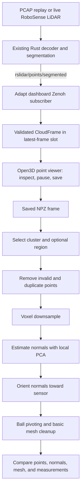

# Mesh visualization v1 overview

## Goal and scope

Capture a segmented RoboSense LiDAR sweep, select a cluster, and inspect how
downsampling, normal estimation, and surface reconstruction affect its mesh.
Use Python, NumPy, and Open3D. Process one saved sweep at a time initially;
continuous meshing, cross-frame tracking, and accumulated maps are later work.

## Current implementation

Step 1 is implemented in `mesh_vis/`; step 2 remains planned. Use
`python3 -m mesh_vis capture` and `python3 -m mesh_vis inspect FILE.npz`.
See the [README](../README.md) for commands and desktop acceptance checks.
The earlier sandbox is preserved under `experiments/legacy/`.

Save requests retain the selected frame at the keypress. Decoding accepts any
valid segmented record count; ring/block layout is not inferred. Publisher
`dense_points` metadata defaults to unknown and can be configured explicitly.
`--expected-records` (alias `--full-records`) is only a diagnostic; zero disables
it everywhere. Version-2 snapshots represent unknown settings and the loader
continues to accept version-1 snapshots.

## System flow

## Step 1 — Reuse the subscriber; add inspection and capture

### 1.1 Extract the existing dashboard implementation

Reuse these sources from the neighboring Autonomy Dashboard repo:

- [LidarSubscriber](../../Autonomy%20Dashboard/igvc-dashboard%20/backend/subscribers/perception.py):
  subscription, payload decoding, lock-protected latest-frame storage, and unsubscribe.
- [ZenohClient](../../Autonomy%20Dashboard/igvc-dashboard%20/backend/zenoh_client.py):
  session startup/shutdown, `LIDAR_ZENOH_KEY`, and `ZENOH_CONFIG` support.
- [Subscriber tests](../../Autonomy%20Dashboard/igvc-dashboard%20/tests/test_lidar_zenoh.py):
  publisher-compatible fixtures and isolated Zenoh integration checks.

Copy/adapt the LiDAR-specific pieces into a standalone module; the source files
also import ROS, camera, and dashboard code that mesh-vis does not need.
Reuse configurable connectivity, but choose endpoints for the actual deployment;
the dashboard's Docker-specific hostname is not a universal default.

### 1.2 Adapt decoding to a typed frame

The existing wire format is little-endian: a 16-byte header
`(int32 seconds, uint32 nanoseconds, uint32 count, uint32 point_step)`, followed
by 20-byte segmented records `(float32 x, y, z, intensity, int32 cluster_id)`.

- Return separate `xyz: N×3 float32`, `intensity: N float32`, and
  `cluster_id: N int32` arrays, plus integer timestamp fields and a local sequence.
- The dashboard reads each record as floats and recovers labels by reinterpreting
  the fifth column's bits. Decode labels directly as little-endian integers here;
  a numeric float-to-int conversion would corrupt them.
- Require the segmented record size for this workflow; validate header and payload
  length. Malformed messages must not replace the last valid frame.
- Preserve received arrays in snapshots; filter nonfinite XYZ for viewing and
  reconstruction. The dashboard currently drops NaNs during decoding and does not
  exclude infinities. Apply any filtering mask consistently across all arrays.
- Store configured `frame_id="rslidar"`, units in metres, and
  `sensor_origin=[0, 0, 0]`; these are assumptions, not transmitted metadata.
- Treat `cluster_id=-1` as unassigned, not ground. IDs are local to each frame.

### 1.3 Add the capture viewer and persistence

- Retain the subscriber's single latest-frame slot; perform GUI updates on the
  main thread. Keep reconstruction out of the callback.
- Show cluster colors, gray unassigned points, axes, counts, and a stable camera.
- Support pause/resume and saving the currently displayed frame.
- Save the full frame to `.npz`, including a format version, source key, and frame
  metadata. Use unique filenames because replay can repeat source timestamps.
- Reopen snapshots without Zenoh. Use local monotonic timing for processing;
  historical replay timestamps do not measure current latency.

**Done when:** PCAP replay displays correctly, a snapshot reloads with identical
arrays and labels, and malformed input leaves the previous frame intact. Adapt
the existing decoder/integration checks and add snapshot round-trip coverage.

## Step 2 — Reconstruct and inspect a saved cluster

### 2.1 Select and prepare

- List cluster point counts, distance ranges, and bounding-box dimensions; select
  a cluster explicitly. Start with a nearby surface spanning multiple scan lines.
- Remove nonfinite XYZ and exact duplicates, apply an optional region/range crop,
  then voxel-downsample. Select the cluster before downsampling to preserve labels.
- Keep the original selected points and downsampled points for comparison.
  Leave statistical outlier removal disabled initially.
- Report insufficient data clearly: the upstream segmenter permits three-point
  clusters, which need not support a useful surface reconstruction.

### 2.2 Estimate and inspect normals

- Use Open3D `estimate_normals` with a radius and neighbor cap. PCA is part of
  normal estimation, not a separate subsequent stage.
- Orient normals toward the sensor origin for these single-view sweeps.
- Visualize a subset of normals before meshing. Neighborhoods must span surface
  patches, not just one scan line. If needed, inspect PCA eigenvalues for line-like
  neighborhoods; the existing mean flatness metric alone cannot distinguish them.

### 2.3 Reconstruct and clean

- Use Open3D ball pivoting with an explicit list of radii as the first baseline.
- Remove duplicate/degenerate triangles and unused vertices; compute mesh normals
  for shading. Report empty meshes rather than treating them as successful output.
- Offer an optional maximum-edge cutoff and report removed triangles. Leave
  smoothing and hole filling disabled initially. Poisson is a later comparison.

### 2.4 Compare and record

- Toggle original points, downsampled points, normals, mesh, and wireframe overlay
  while retaining the camera. Command-line parameter changes are sufficient.
- Save the mesh, exact parameters, input-frame/cluster identity, and a short report:
  stage timings, point/triangle counts, edge-length statistics, and median/p95
  distances from original selected points to the mesh.
- Optionally sample mesh-to-point distances to flag unsupported patches. Treat
  this as a diagnostic: sparse scan lines naturally leave gaps between samples.
- Evaluate a dense nearby surface, a corner/curved object, and a sparse distant
  cluster. Use existing synthetic geometry for known-surface error checks.

**Done when:** repeated runs on a saved cluster expose how parameters affect
surface coverage, normals, and triangles bridging empty space. Visual agreement
and useful coverage matter alongside distance error; input vertices alone are
an overly favorable evaluation set for ball pivoting.

## Initial tuning controls

| Control | Experimental starting point |
| --- | --- |
| Voxel size | 5–10 cm for a nearby cluster |
| Normal radius | Roughly 3–5 voxel widths; inspect whether it spans scan lines |
| Maximum neighbors | Around 50; check that the cap still allows surface support |
| Ball radii | Several values around observed spacing across scan lines |
| Maximum edge length | Optional; set from the largest gap acceptable to bridge |

These are tuning seeds, not sensor-wide defaults. Nearest-neighbor spacing often
reflects spacing along a ring. Downsampling reduces redundancy but cannot supply
missing observations between rings or behind objects.

## Implementation layout and order

- `mesh_vis/frame.py`: frame representation and snapshot save/load.
- `mesh_vis/zenoh_source.py`: adapted subscriber, decoder, and session lifecycle.
- `mesh_vis/reconstruct.py` (planned): pure offline pipeline and parameters.
- Extend `mesh_vis/view.py` for inspection; add pipeline metrics when reconstruction starts.
- `mesh_vis/__main__.py`: `capture` and `inspect` commands; add reconstruction later.
- `tests/`: active pipeline tests; `experiments/legacy/`: preserved playground and its tests.

Implement in this order: adapt decoder and snapshot round-trip → capture viewer
→ saved-cluster selection → downsampling and normal inspection → ball pivoting
and comparison views. Record the working dependency versions, including
`eclipse-zenoh`, for reproducible experiments.
